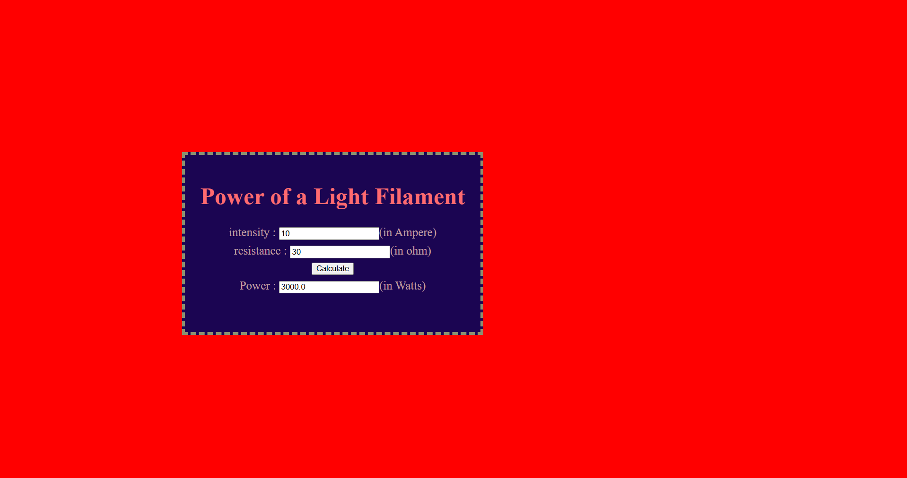

# Ex.05 Design a Website for Server Side Processing
# Date:19-04-2025
# AIM:
To design a website to calculate the power of a lamp filament in an incandescent bulb in the server side.

# FORMULA:
P = I2R
P --> Power (in watts)
 I --> Intensity
 R --> Resistance

# DESIGN STEPS:
## Step 1:
Clone the repository from GitHub.

## Step 2:
Create Django Admin project.

## Step 3:
Create a New App under the Django Admin project.

## Step 4:
Create python programs for views and urls to perform server side processing.

## Step 5:
Create a HTML file to implement form based input and output.

## Step 6:
Publish the website in the given URL.

# PROGRAM :

```

math.html

<html>
<head>
<meta charset='utf-8'>
<meta http-equiv='X-UA-Compatible' content='IE=edge'>
<title>Power of a Lamp Filament</title>
<meta name='viewport' content='width=device-width, initial-scale=1'>
<style type="text/css">
body 
{
background-color:rgb(255, 0, 0);
}
.edge {
width: 1440px;
margin-left: center;
margin-right: center;
padding-top: 250px;
padding-left: 300px;
}
.box {
display:block;
border: Thick dashed rgb(139, 144, 112);
width: 500px;
min-height: 300px;
font-size: 20px;
background-color:hsl(257, 89%, 17%);
}
.formelt{
color:rgba(201, 167, 167, 0.934);
text-align: center;
margin-top: 7px;
margin-bottom: 6px;
}
h1
{
color:rgb(255, 106, 111);
text-align: center;
padding-top: 20px;
}
</style>
</head>
<body>
<div class="edge">
<div class="box">
<h1 align="center">Power of a Light Filament</h1>
<form method="POST">

<div class="formelt">
intensity : <input type="text" name="intensity" value="{{i}}"></input>(in Ampere)<br/>
</div>
<div class="formelt">
resistance : <input type="text" name="resistance" value="{{r}}"></input>(in ohm)<br/>
</div>
<div class="formelt">
<input type="submit" value="Calculate"></input><br/>
</div>
<div class="formelt">
Power : <input type="text" name="power" value="{{power}}"></input>(in Watts)<br/>
</div>
</form>
</div>
</div>
</body>
</html>

views.py

from django.shortcuts import render

def power_calculator(request):
    power = None 
    intensity = None
    resistance = None 

    if request.method == 'POST':
        print("POST method is used")
        
        intensity = request.POST.get('intensity','0')
        resistance = request.POST.get('resistance','0')

        
        if intensity and resistance:
            try:
            
                I = float(intensity)
                R = float(resistance)
                power = I**2 * R
                print('request=',request)
                print('intensity=',I)
                print('resistance=',R)
                print('power=',power)  

            except ValueError:
                power = "Invalid input. Please enter numerical values."

    
    return render(request, 'mathapp/math.html', {'power': power, 'intensity': intensity, 'resistance': resistance})

urls.py

from django.contrib import admin
from django.urls import path
from mathapp import views

urlpatterns = [
    path('admin/', admin.site.urls),
    path('', views.power_calculator, name='power_calculator'),
]

```
# SERVER SIDE PROCESSING:


# HOMEPAGE:



# RESULT:
The program for performing server side processing is completed successfully.
